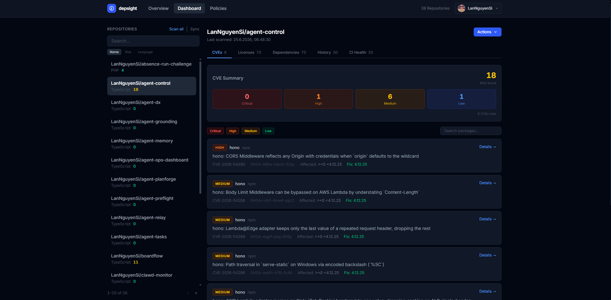

# depsight

GitHub-connected security dashboard: CVEs, licenses, and dependency health, self-hosted.

**Live demo:** [depsight.opentriologue.ai](https://depsight.opentriologue.ai/). Dev Login is on the login page; no credentials needed to look around.



## Overview

Dependency trees rot quietly: a CVE disclosed today against a transitive dependency installed six months ago will not surface until something fails, or until a customer asks. depsight runs continuous CVE, license, and staleness scanning across every repository a team owns, so the answer to "are we shipping known-vulnerable code right now?" is a glance at a dashboard rather than an afternoon of manual audits, across npm, Python, Go, Java, Rust, and PHP.

For the broader operational picture beyond security, see [agent-ops-dashboard](https://github.com/LanNguyenSi/agent-ops-dashboard), which complements depsight with a fleet-wide repo-health view.

## Key features

- Per-repo CVE scanning: severity breakdown, risk scores, vulnerability timeline.
- License detection and copyleft/policy-driven compliance checking.
- Dependency age tracking, outdated alerts, and Dependabot status, with bulk-enable across repos.
- PR auto-comments on CVEs.
- Slack and webhook alerts.
- SBOM export (CycloneDX 1.4).
- A policy engine for custom CVE and license rules.
- An MCP server for agent access (Claude and other MCP-capable clients).

Full feature list, including known limitations, in [docs/features.md](docs/features.md).

## Quick start

Prerequisites: Docker and Docker Compose.

```bash
git clone https://github.com/LanNguyenSi/depsight.git
cd depsight
make dev          # docker compose up: app + Postgres, pushes the DB schema, starts dev server
```

Open http://localhost:3000 and click **Dev Login**. No GitHub OAuth credentials needed for a first look. Add `GITHUB_CLIENT_ID` / `GITHUB_CLIENT_SECRET` to `.env` to connect real repos. See [docs/configuration.md](docs/configuration.md) for env vars and Make targets.

## Usage

Trigger a CVE scan for a tracked repository over the REST API:

```bash
curl -X POST http://localhost:3000/api/scan \
  -H "Authorization: Bearer <token>" \
  -H "Content-Type: application/json" \
  -d '{"repoId": "<repo-id>"}'
```

Create an API token on the Settings page (or via `POST /api/tokens` from a signed-in session); triggering scans needs the default WRITE scope. The dashboard UI covers the same actions without a token. Full endpoint list in [docs/api.md](docs/api.md).

## Documentation

| Doc | Description |
|---|---|
| [docs/configuration.md](docs/configuration.md) | Env vars, Make targets, GitHub OAuth, the CI Health (ci-insights) integration |
| [docs/api.md](docs/api.md) | REST API reference |
| [docs/architecture.md](docs/architecture.md) | Architecture: Next.js App Router, Prisma, project layout |
| [docs/features.md](docs/features.md) | Full feature list and known limitations |
| [docs/roadmap.md](docs/roadmap.md) | Planned work |
| [docs/ways-of-working.md](docs/ways-of-working.md) | Git workflow, deployment, code review checklist |
| [mcp/README.md](mcp/README.md) | MCP server for agent access |
| [CHANGELOG.md](CHANGELOG.md) | Release notes |

## Development

```bash
npm install
npx prisma generate   # required before build on a fresh clone
npm run build
npm test              # vitest
npm run lint          # eslint
```

See [CONTRIBUTING.md](CONTRIBUTING.md) for the full PR workflow and the Docker Compose dev setup.

## License

MIT.

---

Generated with [ScaffoldKit](https://github.com/LanNguyenSi/scaffoldkit).
